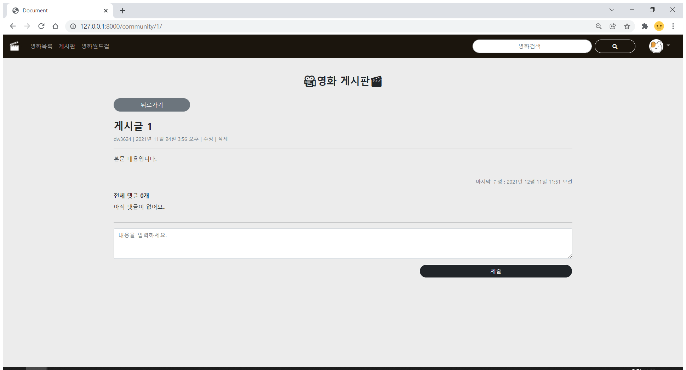
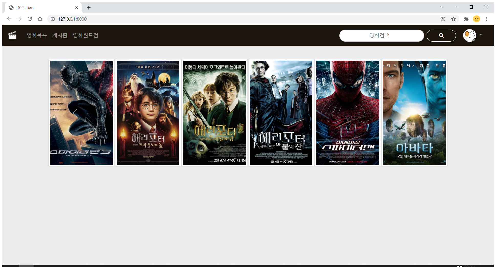
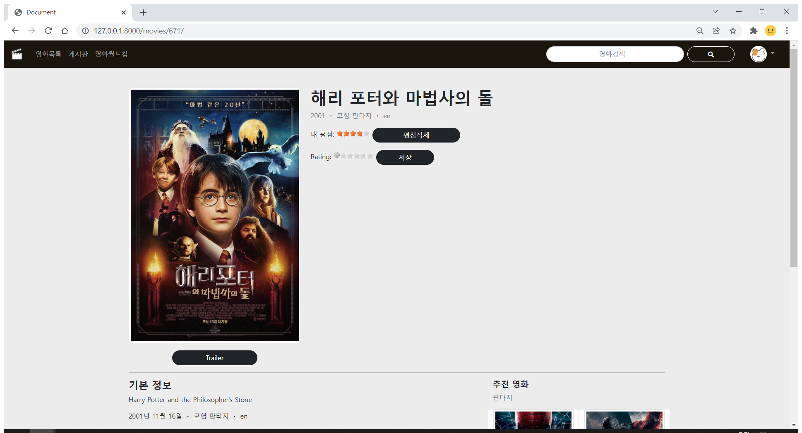
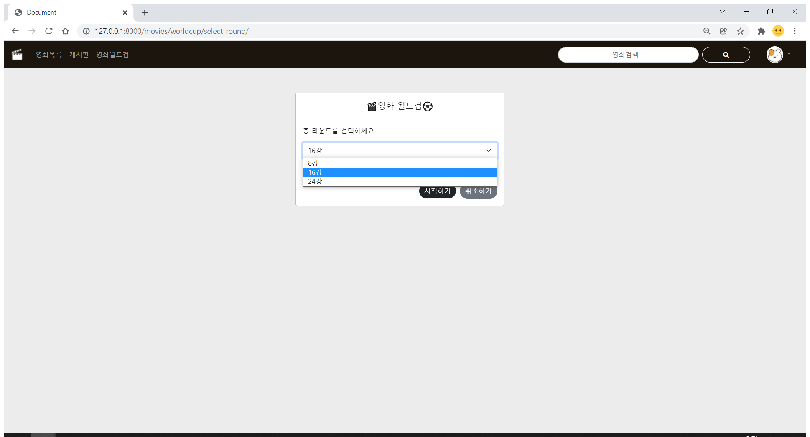

# Movie Tracker

## 목차

- [Description](#Description)
- [Environment](#Environment)
- [Installation](#Installation)
- [Apps](#Apps)
- [Author](#Author)

---


### Description

- 본 서비스는 영화리뷰 커뮤니티 서비스입니다. 영화정보, 영화추천 서비스, 커뮤니티 서비스를 제공합니다.
- 데이터는 TMDB에서 제공하는 api를 적절한 형태로 가공해 사용했습니다.
- 영화추천 서비스는 이상형 월드컵 방식으로 구현했으며, 마지막까지 남은 영화는 프로필 페이지에 추천영화로 추가됩니다.

- 커뮤니티 서비스는 게시판 형태로 구현했습니다. 로그인한 유저는 글을 작성, 수정, 삭제할 수 있습니다. 로그인하지 않은 유저는 작성글 열람만 가능합니다.


### Environment


### Installation

```bash
$ python -m venv venv
$ source venv/Scripts/activate
$ pip install -r requirements.txt
$ python manage.py runserver
```


### Apps

#### Accounts

- 회원가입
  - 사용자 이름, 프로필 사진, 비밀번호를 입력합니다.
  - 회원가입 후 로그인 페이지로 이동합니다.


- 로그인/로그아웃


- 프로필
  - 프로필 사진, 사용자 이름, 시청한 영화(평가한 영화)의 총 런타임을 보여줍니다.
  - 시청한 영화, 작성한 게시글과 댓글 목록을 모달 형태로 보여줍니다.
  - 추천 알고리즘으로 추천받은 영화 목록을 카드 형태로 보여줍니다.


- 작성한 게시글/댓글 조회
  - 작성한 게시글/댓글 목록을 간략히 보여줍니다. 각 항목을 클릭하면 해당 게시글/댓글 페이지로 이동합니다.


#### Community

- 게시글 목록 조회
  - 게시글 목록을 표시합니다. 
  - 로그인하지 않은 사용자는 조회만 가능합니다.


- 게시글 조회
  - 본인이 작성한 게시글은 `수정` 버튼과 `삭제` 버튼으로 편집이 가능합니다.



- 게시글 작성/수정/삭제
  - 위지위그 CKEditor로 작성페이지를 구성했으며, 본문 서식 편집이 가능합니다.
  - `{{ article_content|safe }}` 과 같이 built-in filter를 사용해 서식을 포함한 본문을 표시합니다. 


- 게시글 댓글 작성/수정/삭제
  - 본인이 작성한 댓글을 삭제할 수 있습니다.


#### Movies

- 홈 페이지 - Carousel
  - js로 carousel로 구현했습니다.
  - 좌우 버튼을 누르면 한칸씩 이동합니다.



- 영화 목록 조회
  - 각 영화 포스터를 카드 형태로 표시합니다. 마우스를 올리면 카드 뒷면을 표시합니다.
  - `{{ movie_content|truncatechars:100 }}`과 같이 built-in filter를 사용해 영화 내용을 100자 이내로 표시합니다.


- 영화 검색
  - 검색어가 제목에 포함된 영화를 표시합니다.


- 영화 상세 조회
  - 포스터, 트레일러, 기본정보, 추천영화, 리뷰 목록을 표시합니다.
  - 트레일러는 모달형태로 표시됩니다.
  - 추천영화로 해당 영화와 같은 장르의 영화를 4개 표시합니다.


- 영화 후기 작성/수정/삭제
  - 본인이 입력한 리뷰는 수정/삭제가 가능합니다.


- 영화 평점 등록/수정/삭제
  - widget과 js로 해당 평정 등록 기능을 구현했습니다.
  - 저장된 평점을 삭제 후 평점 수정을 할 수 있습니다.



- 영화 월드컵
  - 추천알고리즘으로 이상형 월드컵을 구현했습니다.
  - js로 작성했으며 8강, 16강, 24강을 선택해 진행할 수 있습니다.
  - 차례로 제시되는 영화들 중 한가지를 선택합니다. 마지막까지 남은 영화는 프로필 페이지의 추천영화에 추가됩니다.




### Author

- 팀장 : [김지호](https://github.com/DMH-JH)
  - DB 설계
  - Accounts app, Community app 기본기능 구현
  - Movies Carousel, 영화월드컵 기능 구현
  - ppt 제작 및 발표
- 팀원 : [강동원](https://github.com/dw3624)
  - DB 설계 및 데이터 수집
  - Movies app 기본기능 구현
  - Profile 페이지 추가기능, 영화제목 검색기능 구현
  - 디자인 구성